# 	cmd常用指令

盘符名称+':'——盘符切换

dir——查看当前路径下的内容

cd+目录——进入单级目录

cd ..——回退到上一级目录

cd 目录1\目录2\...——多级目录跳转

cd \——回退盘符目录

cls——清屏

exit——推出命令提示符窗口

java -version ——验证JAVA版本号及是否正确安装

javac -version——验证JAVAC版本号及是否正确安装

javap——反编译命令

反编译工具——Xjad

# JDK的组成及编译运行

# JAVA程序结构

project（项目）->module（模块）->package（包）->class（类）

# Java文档注释

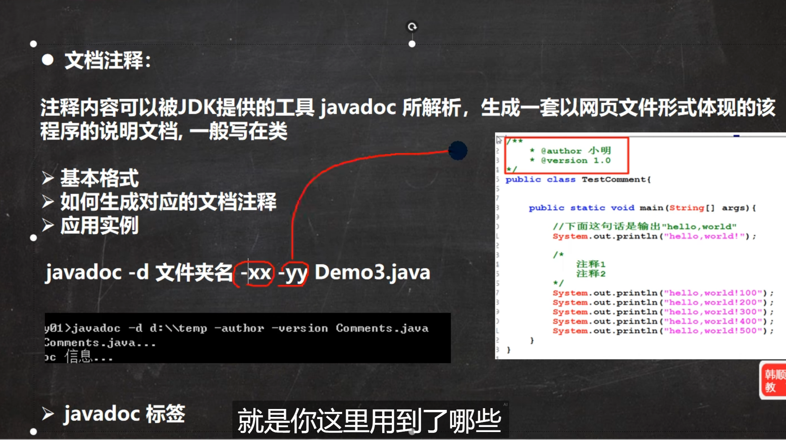

# intellij idea常用快捷键

# JAVASE基础

## JAVA基本语法

### 字面量

### 变量

### 关键字

### 标识符

### 二进制，八进制，十六进制

二进制：以**0b**或**0B**开头

八进制：以**0**开头

十六进制：以**0x**或**0X**开头

### 数据类型

### 自动类型转换

自动类型转换无法高位向低位转，强制类型转换会发生高位截断

### 逻辑运算符

### API应用程序接口

### 输入与输出

#### 输出

`System.out.println()`可以打印一行内容，输出完**自动换行**。

`System.out.printf()`**只能**输出一个**字符串**（Java中的`String`类型）且不能[自动换行](https://so.csdn.net/so/search?q=自动换行&spm=1001.2101.3001.7020)，其他类型输出会报错。

`System.out.print()`可以打印[字符串](https://so.csdn.net/so/search?q=字符串&spm=1001.2101.3001.7020)以及其他的类型（感觉有些类似python中的`print`只不过不能自动换行）。

#### 输入

1.一般类型输入

<变量> = input.next变量类型名(); 变量类型首字母大写

~~~java
import java.util.Scanner;
public class Inputoutput {
    public static void main(String[] args){
        Scanner input=new Scanner(System.in);
        int a;
        byte b;
        float f;
        System.out.println("int input:");
        a=input.nextInt();
        System.out.println("output:"+a);

        System.out.println("byte input:");
        b=input.nextByte();
        System.out.println("output:"+b);

        System.out.println("float input:");
        f=input.nextFloat();
        System.out.println("output:"+f);

        input.close();
    }
}

~~~

2.字符串输入

<变量> = input.next();  // 遇到空格时停止

<变量> = scanner.nextLine(); //  遇到空格时不停止

3.char类型输入

<变量>= input.next().charAt(0);

~~~java
import java.util.Scanner;
public class Inputoutput {
    public static void main(String[] args){
        Scanner input=new Scanner(System.in);
        char c;
        System.out.println("char input:");
        c=input.next().charAt(0);
        System.out.println("output:"+c);
        input.close();
    }
}

~~~

### Swith注意事项

### 随机数Random类

### 数组

### 内存分配

数组在计算机中的执行原理

### 方法

## 面向对象基础

### 构造器

同C++构造函数

### 封装

权限与C++相同

~~~java
public class test {
	// 修饰变量
    public int a;
    private double b; // 修饰符+数据类型+变量名
    // 修饰方法
    public void func1() {}
    private void func2() {}
}
~~~

### JavaBean实体类

特殊形式的类

1. 这个类中的成员变量都要私有，并且要对外提供相应的getxx、setxx方法
2. 类中必须要由一个公共、无参的构造器

特点：

1. 只能有get与set方法不能有其他功能
2. 只是用来存储数据的一个类

#### 实体的应用场景

实体类只负责数据存取，而对数据的处理交给其他类来完成，以实现数据和数据业务处理相分离。

## API基础

API（Application programming interface：应用程序编程接口）

### 包

包是用来分门别类的管理各种不同程序的，类似文件夹，建包有利于程序的管理和维护。

**建包的语法格式**

~~~java
package com.sun.test // 包的地址  通常用网址倒写加项目名
public class 类名
~~~

#### 在程序中调用其他包下的程序的注意事项

- 如果在当前程序中，要调用自己所在包下的其他程序，可以直接调用。（同一个包下的类，互相可以直接调用）
- 如果在当前程序中，要调用其他包下的程序，则必须在当前程序中导包，才可以访问。**导包格式：`import 报名.类名`**
- 如果在当前程序中，要调用java提供的程序，也需要先导包才可以使用；但是java.lang包下的程序是不需要我们导包的，可以直接使用
- 如果在当前程序中，要调用多个不同包下的程序，而这些程序名正好一样，此时默认只能导入一个程序，另一个程序必须带包名访问。

### String

#### 注意事项

##### 1.String是不可变对象。

- String是不可变对象。

- 只要是以“<内容>”方式写出的字符串对象，会在堆内存中的字符串常量池中存储。

~~~java
String s = "balabala";// 此时"balabala"会在堆内存中的字符串常量池中存储。
s += "halahala";//此时"halahala"会存储在堆内存中
~~~

- 综上两点所述：每次试图改变字符串对象实际上是产生了新的字符串对象，变量每次都是指向了新的字符串对象，之前字符串对象的内容确实是没有改变的，因此说String的对象是不可变的。

#### 2

- 只要是以"<内容>"形式给出的字符串对象，会存储到字符串常量池，且相同内容的字符串只存储一份。
- 但通过new方式创建字符串对象，每new一次都会产生一个新的对象放在堆内存中。

双引号的形式的字符串对象会存储到字符串常量池，new会在堆区创建一个对象。

### ArrayList集合

- 集合是一种容器，用来存储数据，类似于数组
- 数组定义完成并启动后，长度就固定了。集合大小可变，开发中用的更多。
- 可以添加不同类型的数据
- 可以通过ArrayList<数据类型>的形式指定数据存储的类型

~~~java
package com.sun.test;

import java.util.ArrayList;

public class main {
    public static void main(String[] args) {

        ArrayList ArrayType = new ArrayList(); // 可以添加任意类型
        ArrayList<Integer> ArrayInt = new ArrayList(); // 只能添加int型
        ArrayType.add("字符串");
        ArrayType.add(100);
        ArrayType.add(1.23);
        ArrayType.add('A');
        System.out.println(ArrayType);
        ArrayInt.add(1);
        ArrayInt.add(1);
        ArrayInt.add(1);
        ArrayInt.add(1);
        System.out.println(ArrayInt);

    }
}

~~~

#### 常用方法

# JAVASE进阶

## 面向对象高级部分

### Static

**静态**，可以修饰成员变量和成员方法。

#### 修饰成员变量

成员变量按照有无static修饰分为**类变量**和**实例变量（对象的变量）**

- 类变量：有static修饰，在计算机中只有一份，会被类的全部对象共享、
- 类变量和实例变量（对象的变量）：无static修饰，属于每个对象

#### 修饰成员方法

分为**类方法**与**实例方法**

#### 注意事项

- 类方法中可以直接访问类的成员，不可以直接访问实例成员
- 实例方法中既可以直接访问类成员，也可以直接访问实例成员
- 实例方法中可以出现this关键字，类方法中不可以出现this关键字

#### 代码块

代码块时类的五大成分之一（成员变量、构造器、方法、代码块、内部类）

##### 代码块分为静态代码块与实例代码块

**静态代码块**

格式：static {}

特点：类加载时自动执行，由于类只会加载一次，所以静态代码块也只会执行一次。

作用：完成类的初始化，例如：对类变量的初始化赋值。

**实例代码块**

格式：{}

特点：每次创建对象时，执行实例代码块，并在构造器前执行。

作用：和构造器一样，都是用来完成对象的初始化的，例如：对实例化对象进行初始化赋值。通常用于管理操作日志。

#### 设计模式

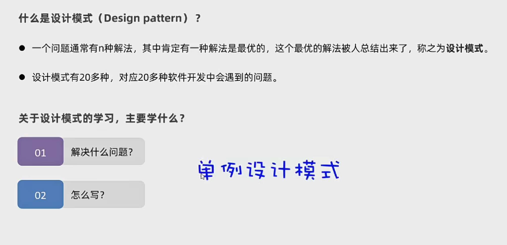

##### 单例设计模式

确保一个类只有一个对象

**写法**

- 把类的构造器私有
- 定义一个类变量记住类的一个对象
- 定义一个类方法返回对象

##### 懒汉式单例设计模式（拿对象是，才开始创建对象）

写法

- 把类的构造器私有
- 定义一个类变量用于存储对象
- 提供一个类方法，保证返回的是同一个对象

**饿汉式**

~~~java
public class Student {

    private static Student std = new Student();

    public static Student getobject() {
        return std;
    }

    private Student() {

    }

}

~~~

**懒汉式**

~~~java
package com.sun.test;

public class Student {

    private static Student std;

    public static Student getobject() {
        if(std == null) std = new Student();
        return std;
    }

    private Student() {

    }

}

~~~

### 继承

#### 权限修饰符（public、private、protected、缺省）

#### 单继承与object类

Java是单继承的，Java中的类不支持多继承，但是支持多层继承。

##### object类

类会默认继承object类

#### 方法重写

#### 子类中访问其他成员的特点

#### 子类构造器的特点

~~~java
public class Son extends Base {

    public Son() {
        super(); // 进行继承操作时默认存在位于程序构造函数开头，用于调用父类构造函数
        
    }

}

~~~

#### this()调用兄弟构造器

调用兄弟构造器.png)

### 多态

**多态的前提**

有**继承/实现**关系；存在父类引用子类对象；**存在方法重写；**

**多态的一个注意事项**：多态是对象、行为的多态，java中的属性（成员变量）不谈多态。

### final

- final关键字是最终的意思，可以修饰（类、方法、变量）
- 修饰类：该类被成为最终类，特点是不能被继承了
- 修饰方法：该方法被成为最终方法，特点是不能被重写了
- 修饰变量：该变量只能被赋值一次

**注意**

- final修饰基本类型的变量，变量存储的**数据**不能被改变
- final修饰引用类型的变量，变量存储的**地址**不能被改变，但地址所指向对象的内容是可以改变的。

#### 常量

- 使用了static final修饰的成员变量就被称为常量
- 作用：通常用于记录系统的配置信息

**优点**

- 代码可读性更好，可维护性也更好。
- 程序编译后，常量会被“宏替换”：出现常量的地方全部会被替换成其记住的字面量，这样可以保证使用常量和直接用字面量的性能是一样的。

### 抽象类

#### 抽象类的注意事项、特点

- 抽象类不一定有抽象方法，有抽象方法的类一定是抽象类。
- 类该有的成员（成员变量、方法、构造器）抽象类都可以有。
- **抽象类最主要的特点：抽象类不能创建对象，仅作为特殊的父类，让子类继承并实现。**
- 一个类继承抽象类，必须重写抽象类的抽象方法，否则这个类也必须定义成抽象类。

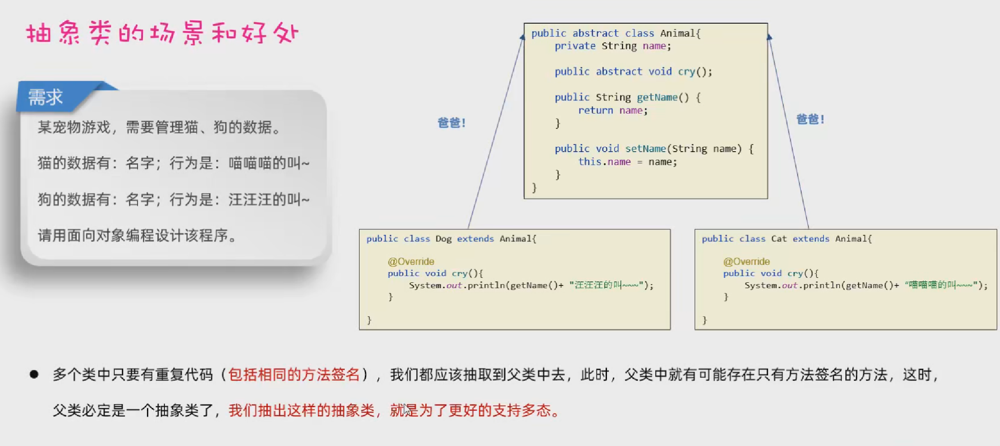

#### 模板方法设计模式

### 接口

**接口只允许有常量与抽象类**

 

##### 接口的好处

#### JDK8开始，接口中新增的三种方法

#### 接口的多继承

通过继承将多个接口合并为一个接口

### 内部类

- 是类中的五大成分之一（成员变量、方法、构造器、内部类、代码块），**如果一个类定义在另一个类的内部，这个类就是内部类。**
- 场景：当一个类的内部，包含了一个完整的事物，且这个事物没有必要单独设计时，就可以把这个事物设计成内部类

#### 成员内部类

#### 静态内部类

有static修饰的内部类，属于外部类自己持有

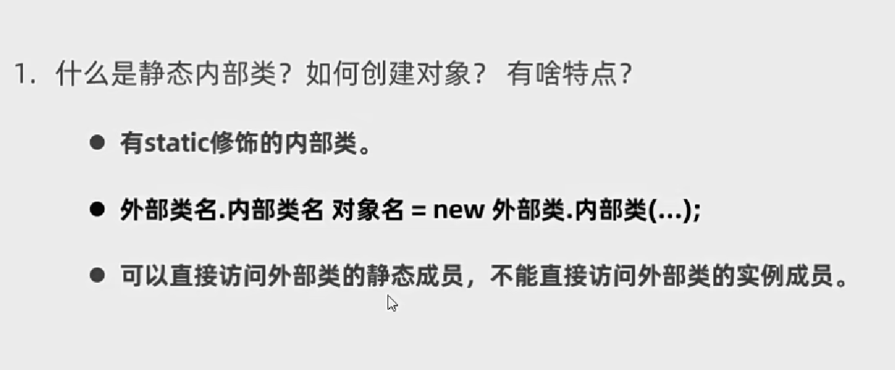

#### 局部内部类（鸡肋语法，没啥用）

#### 匿名内部类（重点）

- 就是一种特殊的局部内部类；所谓匿名是指程序员不需要为这个类声明名字。
- 特点：匿名内部类本质就是一个子类，并会立即创建出一个子类对象
- 作用：用于更方便的创建一个子类对象

**语法格式**

~~~java
new 类或接口(参数列表) {
    类体（一般是方法重写）
};
~~~

### 枚举

- 枚举是一种特殊的类

**格式**

~~~java
修饰符 enum 枚举类名{
    名称1,名称2...;
    其他成员;
}
~~~

### 泛型

- 定义类、接口、方法时，同时声明了一个或多个类型变量（如：<E>），称为泛型类、泛型接口、泛型方法，它们统称为泛型。

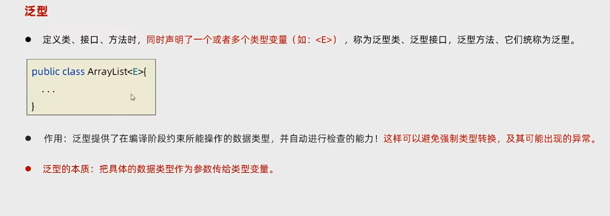

#### 泛型类

可以通过"` 修饰符 class 类名<E extends 类名>`"来设置限制条件，只有继承某些类才能使用泛型。

#### 泛型接口

#### 泛型方法、通配符、泛型的上下限

#### 泛型的注意事项：擦除问题、基本数据类型问题

- 泛型是工作在编译阶段的，一但程序编译成class文件，class文件中就不存在泛型了。
- 泛型不支持基本数据类型，只能支持对象类型（引用数据类型）。

## 常用API

### Object类

- Object是Java中所有类的祖宗类，因此，Java中所有类的对象都可以直接使用Object类中提供的一些方法。

#### toString和equals方法

#### 克隆方法

**clone方法使用时必须实现接口Cloneable，该接口是一个空接口，是一个标志。**

### Objects类

### 包装类

### StringBuilder

### StringJoiner

### Math、System

### Runtime

### BigDecimal

舍入模式使用：RoundingMode类进行控制。

### 时间日期类

#### Jdk8之前的传统日期时间

##### Date

 

##### SimpleDateFormat

**构造器中的字符串应为日期格式**

##### Calendar

#### Jdk8开始的新增的日期时间

##### 为什么要学Jdk8新增的时间

Jdk8之前传统的时间API

1. 设计不合理，使用不方便，很多都被淘汰了。
2. 都是可变对象，修改后会丢失最开始的时间信息。
3. 线程不安全。
4. 只能精确到毫秒。

Jdk8开始新增的时间API

1. 设计更合理，功能丰富，使用更方便。
2. 都是不可变对象，修改后会返回新的时间对象。
3. 线程安全。
4. 能精确到毫秒、纳秒。

##### LocalDate、LocalTime、LocalDateTime

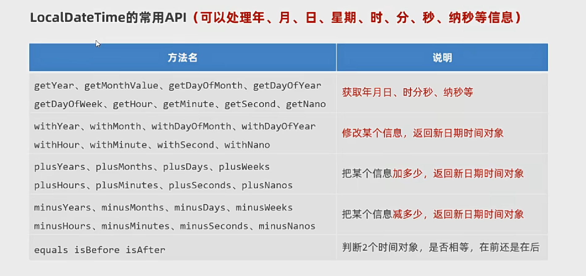

LocalDateTime可以通过toLocalDate(),toLocalTime()将数据转换为以上两种类型。

~~~java
LocalDateTime ldt = LocalDateTime.now();
Local ld = ldt.toLocalDate();
Local lt = ldt.toLocalTime();
~~~

##### ZoneId、ZonedDateTime

##### Instand

##### DateTimeFormatter

##### Period、Duration

### Arrays类

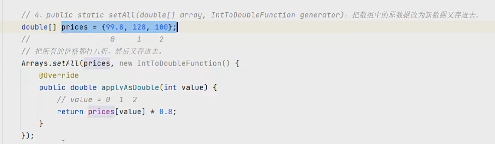

#### sort排序

~~~java
public class main {
    public static void main(String[] args) {

        // 此处使用int[] 类型式会报错不知道为啥
        Integer[] a = {1, 4, 2, 3};
        System.out.println(Arrays.toString(a));
        Arrays.sort(a);
        System.out.println(Arrays.toString(a));
        Arrays.sort(a, new Comparator<Integer>() {
            @Override
            public int compare(Integer a, Integer b) {
                return -Integer.compare(a, b);
            }
        });
        System.out.println(Arrays.toString(a));

    }
}
~~~

## Jdk8新特性--Lambda

### Lambda表达式

**错误示例**

~~~java
public class main {
    public static void main(String[] args) {

        Swimming s = new Swimming() {
            @Override
            public void func() {
                System.out.println("小狗游的飞快");
            }
        };

//        此处报错提示Target type of a lambda conversion must be an interface（lambda转换的目标类型必须是接口）
//        Swimming s2 = () -> {
//            System.out.println("小狗游的飞快");
//        };

    }
}

abstract class Swimming{

  public abstract void func();

};
~~~

**正确写法**

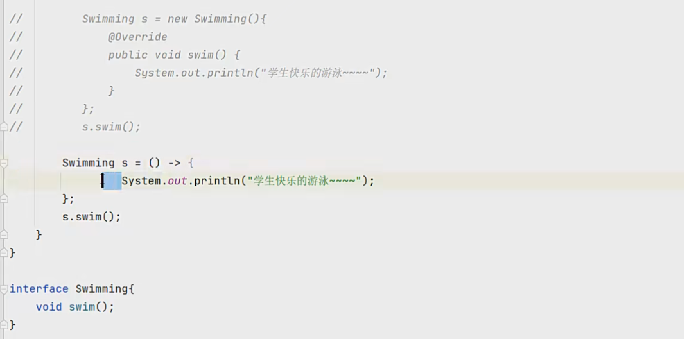

~~~java
public class main{
    public static void main(String[] args) {

        // 使用Lambda表达式简化前
        Swimming s1 = new Swimming() {
            @Override
            public void func() {

            }
        };

        // // 使用Lambda表达式简化后
        Swimming s2 = () -> {
            System.out.println("小狗游的飞快");
        };

    }
}

interface Swimming {
    void func();
}
~~~

#### 省略规则

### 方法引用（通常用于进一步简化Lambda表达式）

方法引用的标志性符号（::）

#### 静态方法的引用

- 类名::静态方法
- 使用场景：如果某个lambda表达式只是调用一个静态方法，并且前后参数的形式一致，就可以使用静态方法引用。

~~~java
package com.sun.test;

import java.util.Arrays;
import java.util.Comparator;

public class main {
    public static void main(String[] args) {

        Integer[] a = {1, 4, 2, 3};
        System.out.println(Arrays.toString(a));
        Arrays.sort(a);
        System.out.println(Arrays.toString(a));
        Arrays.sort(a, cmp::cmpInt);
        System.out.println(Arrays.toString(a));

    }
}

class cmp{

    public static int cmpInt(Integer x, Integer y) {
        return y - x;
    }

}
~~~

#### 实例方法的引用

- 对象名::实例方法
- 使用场景：如果某个lambda表达式只是调用一个实例方法，并且前后参数的形式一致，就可以使用实例方法引用。

~~~java
package com.sun.test;

import java.util.Arrays;

public class main {
    public static void main(String[] args) {

        // 使用Lambda表达式
        Integer[] a = {1, 4, 2, 3};
        Arrays.sort(a, (o1, o2) -> o2 - o1);
        System.out.println(Arrays.toString(a));

        // 使用实例方法引用
        Cmp  cmp = new Cmp(); // 创建一个对象来进行实例实例方法引用
        Integer[] b = {5, 7, 6, 8};
        Arrays.sort(b, (o1, o2) -> cmp.cmpIntAge(o1, o2));
        System.out.println(Arrays.toString(b));

        // 进一步简化
        Integer[] c = {10, 9, 12, 11};
        Arrays.sort(c, cmp::cmpIntAge);
        System.out.println(Arrays.toString(c));

    }
}

class Cmp{

    // 静态方法的引用
    public static int cmpInt(Integer x, Integer y) {
        return y - x;
    }

    // 实例方法的引用
    public int cmpIntAge(Integer x, Integer y) {
        return y - x;
    }

}
~~~

#### 特定类型的方法引用

- 类型::方法
- 使用场景：如果某个Lambda表达式里只是调用一个实例方法，并且前面参数列表中的第一个参数作为方法的主调，后面的所有参数都是作为该实例方法的入参的，则此时就可以使用特定类型的方法引用。

~~~java
package com.sun.test;

import java.util.Arrays;
import java.util.Comparator;

public class main {
    public static void main(String[] args) {

        String[] names = {"boby", "angela", "Andy", "dlei", "caocao", "Babo", "jack", "Cici"};

        // 默认排序--默认是按字符串首字母编号（ASCII码）升序排序的
        Arrays.sort(names);
        System.out.println("默认排序："+Arrays.toString(names));

        // 忽略大小写进行排序
        // 匿名内部类
        String[] names1 = names.clone();
        Arrays.sort(names1, new Comparator<String>() {
            @Override
            public int compare(String o1, String o2) {
                return o1.compareToIgnoreCase(o2); // 字符串类型自带方 可以忽略大小写比较字符串大小
            }
        });
        System.out.println("匿名内部类："+Arrays.toString(names1));

        // Lambda表达式优化后
        String[] names2 = names.clone();
        Arrays.sort(names2, (o1, o2) -> o1.compareToIgnoreCase(o2));
        System.out.println("Lambda："+Arrays.toString(names2));

        // 特定类型的方法引用进一步简化后
        String[] names3 = names.clone();
        Arrays.sort(names3, String::compareToIgnoreCase);
        System.out.println("特定类型的方法引用：："+Arrays.toString(names3));

    }
}
~~~

#### 构造器引用

- 类名::new
- 如果某个Lambda表达式里只是在创建对象，并且前后参数情况一致，就可以使用构造器引用。

~~~java
package com.sun.test;

public class main {
    public static void main(String[] args) {

        // 默认方式创建接口的匿名内部类
        CreatCar cc1 = new CreatCar() {
            @Override
            public Car create(String name, double price) {
                return new Car(name, price);
            }
        };
        Car car1 = cc1.create("奔驰", 100);

        // Lambda表达式
        CreatCar cc2 = (name, price) -> new Car(name, price);
        Car car2 = cc2.create("宝马", 200);

        // 构造器引用
        CreatCar cc3 = Car::new;
        Car car3 = cc3.create("保时捷", 300);

    }
}

class Car {

    private String name;
    private double price;

    public Car() {
    }

    public Car(String name, double price) {
        this.name = name;
        this.price = price;
    }
}

interface CreatCar{
    Car create(String name, double price);
}
~~~

## 常见算法

### 排序：选择、冒泡

### 查找：普通、二分

## 正则表达式

- 就是有一些特定的字符组成，代表的是一个规则。

### 作用

1.**用来校验数据是否合法**

~~~java
package com.sun.test;

// 检验QQ号是否合法 只包含数字，长度为6-20,不能以0开头
public class main {
    public static void main(String[] args) {

        String s1 = "1234567890";
        String s2 = "12345q7890";

        // 普通匹配方法测试
        System.out.println(checkqq(s1));
        System.out.println(checkqq(s2));

        // 正则表达式测试
        System.out.println(CheckqqRegularExpression(s1));
        System.out.println(CheckqqRegularExpression(s2));

    }

    // 普通匹配方法
    public static boolean checkqq(String qq) {

        if(qq == null || (qq.length() > 20 && qq.length() < 6) || qq.startsWith("0")) return false;
        for(int i = 0; i < qq.length(); i++) {
            if(qq.charAt(i) > '9' || qq.charAt(i) < '0') return false;
        }
        return true;

    }

    // 正则表达式
    public static boolean CheckqqRegularExpression(String qq) {

        return qq != null && qq.matches("[1-9]\\d{5,19}"); // [1-9]表示第一位数字范围为1-9  //d{5,}表示后面的数字有5-19位

    }

}
~~~

2.**在一段文本中查找满足要求的内容**

### 书写规则

~~~java
package com.sun.RegularExpression_WritingRule;

// 测试正则表达式书写规则
// 详细规则可在java的apk文档中搜索Pattern进行查看
public class main {
    public static void main(String[] args) {

        // 1.字符类（只能匹配单个字符）
        System.out.println("[abc]");
        System.out.println("a".matches("[abc]")); // [abc]只能匹配a、b、c  true
        System.out.println("d".matches("[abcde]")); // true

        System.out.println("[^abc]");
        System.out.println("q".matches("[^abc]")); // [^abc]不能是abc true
        System.out.println("q".matches("[^abq]")); // false

        System.out.println("[a-zA-Z]");
        System.out.println("a".matches("[a-zA-Z]")); // [a-zA-Z]只能是a-z A-Z之间的字符 true
        System.out.println("2".matches("[a-zA-Z]")); // false
        System.out.println("a".matches("[1-9]")); // false
        System.out.println("1".matches("[a-zA-Z1-9]")); // true

        System.out.println("[a-z&&[^bc]]");
        System.out.println("a".matches("[a-z&&[^bc]]")); // [a-z&&^bc] a-z除了b、c true
        System.out.println("b".matches("[a-z&&[^bc]]")); // false

        // 2.预定义字符（只能匹配单个字符）
        /* 由于\通常用于转义字符，所以需要\\来说明\问一个正常的反斜杠
        同理 也可以通过\"来输出双引号*/

        System.out.println("[\\d]");
        System.out.println("3".matches("[\\d]")); // [\d] 0-9的整数  true
        System.out.println("q".matches("[\\d]")); // false

        System.out.println("[\\s]"); // \s 是转义字符代表空字符
        System.out.println(" ".matches("[\\s]")); // [\s] 是空白字符 true
        System.out.println("a".matches("[\\s]")); // false

        System.out.println("[\\S]");
        System.out.println(" ".matches("[\\S]")); // [\S] 非空白字符 false
        System.out.println("a".matches("[\\S]")); // true

        System.out.println("[\\w]");
        System.out.println("a".matches("[\\w]")); // [\w] 是a-z,A-Z,0-9 true
        System.out.println("*".matches("[\\w]")); // false

        System.out.println("[\\W]");
        System.out.println("a".matches("[\\W]")); // [\W] 是非a-z,A-Z,0-9 false
        System.out.println("*".matches("[\\W]")); // true
        System.out.println("*".matches("[^\\w]")); // [^\w]效果与[\W]相同 true

    }
}

~~~

### 爬取信息

### 搜索、替换、分割

## 集合进阶

### Collection

~~~java
// 常用方法
package com.sun.test;

import java.util.ArrayList;
import java.util.Arrays;
import java.util.Collection;

public class main {
    public static void main(String[] args) {

        Collection<String> c = new ArrayList<>(); // 多态写法
        // 1.public boolean add(E e); 添加元素，添加成功返回true
        System.out.println(c.add("123"));

        // 2.public void clear();清空集合的元素
        c.clear();
        System.out.println(c);

        // 3.public boolean isEmpty(); 判断集合是否为空，为空返回true
        System.out.println(c.isEmpty());

        // 4.public int size(); 获取集合大小
        System.out.println(c.size());

        // 5.public boolean contains(Object obj); 判断集合中是否包含某个元素。
        c.add("123");
        c.add("456");
        c.add("789");
        c.add("456");
        System.out.println(c.contains("123"));

        // 6.public boolean remove(E e); 删除指定元素，如果有重复，默认删除前面的第一个。删除成功返回true
        System.out.println(c);
        System.out.println(c.remove("456"));
        System.out.println(c);

        // 7.public Object[] toArray(); 把集合转换成数组
        Object[] arr = c.toArray();
        System.out.println(Arrays.toString(arr));

        String[] arr2 = c.toArray(c.toArray(new String[c.size()]));
        System.out.println(Arrays.toString(arr));
        // 8.public boolean addAll(Collection<? extends E> c); 将c添加对象末尾
        ArrayList<Integer> a = new ArrayList<>();
        ArrayList<Integer> b = new ArrayList<>();
        a.add(1);
        a.add(2);
        b.add(3);
        b.add(4);
        System.out.println(a);
        a.addAll(b);
        System.out.println(a);

    }
}
~~~

#### 集合遍历方法

**迭代器**

~~~java
package com.sun.test;

import java.util.ArrayList;
import java.util.Collection;
import java.util.Iterator;

public class main {
    public static void main(String[] args) {

        Collection<String> c = new ArrayList<>();
        c.add("1");
        c.add("2");
        c.add("3");
        c.add("4");

        // 从集合对象中获取迭代器对象
        Iterator<String> it = c.iterator();
        while(it.hasNext()) {
            System.out.println(it.next());
        }

    }
}
~~~

**增强for循环**

~~~java
package com.sun.test;

import java.util.ArrayList;
import java.util.Collection;
import java.util.Iterator;

public class main {
    public static void main(String[] args) {

        Collection<String> c = new ArrayList<>();
        c.add("1");
        c.add("2");
        c.add("3");
        c.add("4");

        // 使用增强for循环遍历集合
        for(String ele: c) {
            System.out.println(ele);
        }

        // 使用增强for循环遍历数组
        int[] a = {1, 2, 3, 4};
        for(int ele : a) {
            System.out.println(ele);
        }

    }
}
~~~

**Lambda**

~~~java
package com.sun.test;

import java.util.ArrayList;
import java.util.Collection;
import java.util.Iterator;
import java.util.function.Consumer;

public class main {
    public static void main(String[] args) {

        Collection<String> c = new ArrayList<>();
        c.add("1");
        c.add("2");
        c.add("3");
        c.add("4");

        // 匿名内部类形式
        c.forEach(new Consumer<String>() {
            @Override
            public void accept(String s) {
                System.out.println(s);
            }
        });

        // Lambda简化后
        c.forEach(s -> System.out.println(s));

        // 方法引用简化后
        c.forEach(System.out::println);

    }
}
~~~

#### List系列集合

- 代表：ArrayList、LinkedList
- 特点：有序，可重复，有索引

##### List集合特有方法

~~~java
package com.sun.test;

import java.util.ArrayList;
import java.util.List;

public class main {
    public static void main(String[] args) {

        List<String> c = new ArrayList<>();
        c.add("1");
        c.add("2");
        c.add("3");
        c.add("4");
        System.out.println(c);

        // 1.public void add(int index, E element); 在某个索引位置插入元素
        c.add(1, "1");
        System.out.println(c);

        // 2.public E remove(int index); 删除索引位置的元素并返回元素
        System.out.println("remove:"+c.remove(1));
        System.out.println(c);

        // 3.public E get(int index); 返回指定位置的元素
        System.out.println("get:"+c.get(2));

        // 4.public E set(int index, E element); 修改索引位置的元素，修改成功后返回原来的元素
        System.out.println("original:"+c.set(2, "7"));
        System.out.println("transform:"+c);

    }
}
~~~

List支持的遍历方式

1. for循环
2. 迭代器
3. 增强for循环（foreach遍历）
4. Lambda表达式

##### LinkedList新增方法

#### Set系列

- 代表：HashSet、TreeSet、LinkedHashSet
- 特点：无序（存入顺序与取出顺序不一致）、不重复、无索引

**特点**

1. HashSet：无序、不重复、无索引
2. LinkedHashSet：有序、不重复、无索引
3. TreeSet：排序、不重复、无索引

##### HashSet底层原理

###### 哈希值

###### 底层原理

- 基于**哈希表**实现
- 哈希表是一种增删改查性能都较好的数据结构

**哈希表**

- Jdk8之前，哈希表=数组+链表
- Jdk8之后，哈希表=数组+链表+红黑树

###### 去重复机制

如果希望Set集合内容两个一样的对象是重复的，必须重写对象的HashCode()和equals()方法。

##### LinkedHashSet底层原理

- 依然是基于哈希表实现的
- 它的每个元素都会多一个双链表的机制记录它的前后位置

##### TreeSet集合底层原理

###### 自定义排序规则

#### 使用场景

#### 补充：集合的并发修改异常问题

~~~java
package com.sun.test;

import java.util.ArrayList;
import java.util.Iterator;
import java.util.List;

public class main {
    public static void main(String[] args) {

        List<String> c = new ArrayList<>();
        c.add("123");
        c.add("234");
        c.add("345");
        c.add("456");
        // 需求：删除字符串中包含2的数据
        Iterator<String> it = c.iterator();
        while(it.hasNext()) {
            String s = it.next();
            // if(s.contains("2")) c.remove(s); 使用集合本身的删除会发生并发处理异常
            if(s.contains("2")) it.remove(); // 使用迭代器自身的删除则不会报错，相当于在底层i--
        }
        
        // for循环可以使用i--或倒着循环来解决问题
        // 增强for循环与Lambda无法解决该问题

    }
}
~~~

#### Collections集合工具类

##### 前置知识：可变参数

~~~java
package com.sun.test;

import java.util.Arrays;

public class main {
    public static void main(String[] args) {

        test(); // 不传数据
        test(1); // 传一个数据给可变参数
        test(1,2,3); // 传多个数据
        test(new int[]{1, 2, 3, 4}); // 传一个数组

    }

    public static void test(int...arrs) {

        System.out.println(Arrays.toString(arrs));

    }

}
~~~

##### Collections

###### Collections常用静态方法

~~~java
package com.sun.test;

import java.util.ArrayList;
import java.util.Collections;
import java.util.List;

public class main {
    public static void main(String[] args) {

        List<String> c = new ArrayList<>();

        // 1.public static <T> boolean addAll(Collection<? super T> c, T...elements); 为集合批量添加数据
        Collections.addAll(c, "1", "2");
        Collections.addAll(c, new String[]{"3", "4"});
        String[] s = {"5", "6"};
        Collections.addAll(c, s);
        System.out.println(c);

        // 2.public static void shuffle(List<?> list); 打乱list集合中的元素顺序
        Collections.shuffle(c);
        System.out.println(c);

        // 3.public static <T> void sort(List<T> list); 对集合中的元素升序排序
        Collections.sort(c);
        System.out.println(c);

        // 4.public static <T> void sort(List<T> list, Comparator<? super T> c); 对集合中的元素按照规则c排序
        Collections.sort(c, (o1, o2) -> o2.compareToIgnoreCase(o1));
        System.out.println(c);

    }
}
~~~

### Map系列集合

#### Map集合常用方法

~~~java
package com.sun.test;

import java.util.*;

public class main {
    public static void main(String[] args) {

        // 1.V put(K key, V value); 添加键值
        Map<String,Integer> map = new HashMap<>();
        map.put("1", 1);
        map.put("2", 2);
        map.put("3", 3);
        System.out.println(map);

        // 2.public int size(); 获取集合的大小
        System.out.println(map.size());

        // 3.public void clear(); 清空集合
        map.clear();
        System.out.println(map);

        // 4.public boolean isEmpty(); 判断集合是否为空，为空返回true
        System.out.println(map.isEmpty());

        // 5.public V get(Object key); 根据键获取对应值
        map.put("1", 1);
        map.put("2", 2);
        map.put("3", 3);
        System.out.println(map.get("1"));

        // 6.public V remove(Object key); 根据键删除整个元素（删除键会返回键的值）
        System.out.println(map.remove("2"));
        System.out.println(map);

        // 7.public boolean containsKey(Object key); 判断是否包含某个键，包含返回true
        System.out.println(map.containsKey("1"));
        System.out.println(map.containsKey("2"));

        // 8.public boolean containsValue(Object value); 判断是否包含某个值
        System.out.println(map.containsValue(1));
        System.out.println(map.containsValue(2));

        // 9.public Set<K> KeySet(); 获取Map集合的全部键
        Set<String> set = new HashSet<>();
        set = map.keySet();
        System.out.println(set);

        // 10。public Collection<V> values(); 获取Map集合的全部值
        Collection<Integer> c = new ArrayList<>();
        c = map.values();
        System.out.println(c);

        // 11.public void putAll(Map<? extends K, ? extends V> m); 将一个Map的数据存入另一个Map中
        Map<String, Integer> mapcopy = new HashMap<>();
        mapcopy.put("2", 2);
        map.putAll(mapcopy);
        System.out.println(map);

    }
}
~~~

#### 遍历方式

##### 键找值

~~~java
package com.sun.test;

import java.util.HashMap;
import java.util.Map;
import java.util.Set;

public class main {
    public static void main(String[] args) {

        Map<String, Integer> map = new HashMap<>();
        map.put("一",1);
        map.put("二",2);
        map.put("三",3);
        map.put("四",4);
        Set<String> set = map.keySet();
        for(String it: set) {
            Integer temp = map.get(it);
            System.out.println(it + "-" + temp);
        }

    }
}
~~~

##### 键值对

~~~java
package com.sun.test;

import java.util.HashMap;
import java.util.Map;
import java.util.Set;

public class main {
    public static void main(String[] args) {

        Map<String, Integer> map = new HashMap<>();
        map.put("一",1);
        map.put("二",2);
        map.put("三",3);
        map.put("四",4);

        Set<Map.Entry<String, Integer>> entrise = map.entrySet(); // 创建用Set封装的键值对对象
        for(Map.Entry<String, Integer> entry : entrise) {
            String key = entry.getKey();
            Integer value = entry.getValue();
            System.out.println(key + "=" + value);
        }

    }
}
~~~

##### Lambda

~~~java
package com.sun.test;

import java.util.HashMap;
import java.util.Map;
import java.util.Set;
import java.util.function.BiConsumer;

public class main {
    public static void main(String[] args) {

        Map<String, Integer> map = new HashMap<>();
        map.put("一",1);
        map.put("二",2);
        map.put("三",3);
        map.put("四",4);

        // 使用forEach()遍历
        map.forEach(new BiConsumer<String, Integer>() {
            @Override
            public void accept(String s, Integer integer) {
                System.out.println(s + "-" + integer);
            }
        });

        // 使用Lambda简化后
        map.forEach((k, v) -> System.out.println(k + '=' + v));

    }
}
~~~

#### HashMap

~~~java
// 重载hashCode和equals的方法
// 1.在类内右击  2.选择generate  3.选择equals and hashCode 4.一路next
package com.sun.test;

import java.util.Objects;

public class main {
    public static void main(String[] args) {

    }
}

class Student{

    private String name;
    private int age;

    @Override
    public boolean equals(Object o) {
        if (this == o) return true;
        if (o == null || getClass() != o.getClass()) return false;
        Student student = (Student) o;
        return age == student.age && Objects.equals(name, student.name);
    }

    @Override
    public int hashCode() {
        return Objects.hash(name, age);
    }

    public Student() {
    }

    public Student(String name, int age) {
        this.name = name;
        this.age = age;
    }

}
~~~

#### LinkedHashMap

#### TreeMap

~~~java
package com.sun.test;

import java.util.Comparator;
import java.util.Map;
import java.util.TreeMap;

public class main {
    public static void main(String[] args) {

        Map<String, Integer> map = new TreeMap<>(new Comparator<String>() {
            @Override
            public int compare(String o1, String o2) {
                return o1.compareToIgnoreCase(o2);
            }
        });

        map.put("1", 1);
        map.put("2", 1);
        map.put("3", 1);
        System.out.println(map);

    }
}
~~~

### 集合的嵌套

~~~java
package com.sun.test;

import java.util.*;

public class main {
    public static void main(String[] args) {

        Map<String, List<String>> map = new HashMap<>();
        List<String> citys1 = new ArrayList<>();
        List<String> citys2 = new ArrayList<>();
        List<String> citys3 = new ArrayList<>();
        Collections.addAll(citys1, "南京市", "苏州市", "扬州市", "无锡市", "常州市");
        map.put("江苏省", citys1);
        Collections.addAll(citys2, "武汉市", "孝感市", "十堰市", "宜昌市", "鄂州市");
        map.put("湖北省", citys2);
        Collections.addAll(citys3, "石家庄市", "唐山市", "邢台市", "保定市", "张家口市");
        map.put("河北省", citys3);

        // 遍历
        System.out.println("遍历1："+map);
        System.out.println("遍历2：");
        map.forEach((k, v) -> System.out.println(k + '=' + v));

        // 遍历单个省的城市
        List<String> citys = map.get("湖北省");
        for(String s : citys) {
            System.out.println(s);
        }

    }
}
~~~

## JDK8新特性--Stream

~~~java
package com.sun.test;

import java.util.ArrayList;
import java.util.Collections;
import java.util.List;
import java.util.stream.Collectors;

public class main {
    public static void main(String[] args) {

        List<String> names = new ArrayList<>();
        Collections.addAll(names, new String[]{"张三丰", "张无忌", "周芷若", "赵敏", "张强"});

        // 要求：将张姓且名字为三个字的人分配为一个集合
        // 正常遍历
        List<String> list1 = new ArrayList<>();
        for(String name : names) {
            if(name.startsWith("张") && name.length() == 3) {
                list1.add(name);
            }
        }
        System.out.println("常规方法遍历：" + list1);

        // Stream流
//        List<String> list2 = names.stream().filter(s -> s.startsWith("张")).filter(s -> s.length() == 3).collect(Collectors.toList());
        List<String> list2 = names.stream().filter(s -> s.startsWith("张") && s.length() == 3).collect(Collectors.toList());
        System.out.println("Stream流："+list2);

    }
}
~~~

### 如何获取Stream流

~~~java
package com.sun.test;

import java.util.*;
import java.util.stream.Stream;

public class main {
    public static void main(String[] args) {

        // 如何获取list集合的Stream流
        List<String> list = new ArrayList<>();
        Collections.addAll(list, new String[]{"张三丰", "张无忌", "周芷若", "赵敏", "张强"});
        Stream<String> liststream = list.stream();

        // 如何获取Set集合的Stream流
        Set<String> set = new HashSet<>();
        Collections.addAll(set, new String[]{"张三丰", "张无忌", "周芷若", "赵敏", "张强"});
        Stream<String> setstream = set.stream();

        // 如何获取Map集合的Stream流
        Map<String, Integer> map = new HashMap<>();
        map.put("123", 1);
        map.put("234", 2);
        map.put("345", 3);
        map.put("456", 4);

        Set<String> key = map.keySet();
        Stream<String> keystream = key.stream();

        Collection<Integer> value = map.values();
        Stream<Integer> valuestream = value.stream();

        Set<Map.Entry<String, Integer>> entries = map.entrySet();
        Stream<Map.Entry<String, Integer>> entryStream = entries.stream();
        entryStream.filter(o -> o.getKey().contains("2")).forEach(e -> System.out.println(e.getKey() + '=' + e.getValue()));

        // 如何获取数组的Stream流
        String[] arrs = {"张三丰", "张无忌", "周芷若", "赵敏", "张强"};
        Stream<String> arrsstream1 = Arrays.stream(arrs);
        Stream<String> arrsstream2 = Stream.of(arrs);

    }
}
~~~

### Sream流常用的中间方法

~~~java
package com.sun.test;

import java.util.ArrayList;
import java.util.Collections;
import java.util.List;
import java.util.stream.Stream;

public class main {
    public static void main(String[] args) {

        // 如何获取list集合的Stream流
        List<Double> list = new ArrayList<>();
        Collections.addAll(list, 88.5, 100.0, 60.0, 99.0, 9.5, 99.6, 99.6);

        // 找出大于等于60的数据，升序排序后输出
        list.stream().filter(l -> l >= 60).sorted().forEach(l -> System.out.println(l));

        // 找出大于等于60并小于等于100的数据并降序输出
        list.stream().filter(l -> l >= 60 && l <= 100).sorted((o1, o2) -> o2.compareTo(o1)).forEach(l -> System.out.println(l));

        // 取出前三位数据并输出
        list.stream().limit(3).forEach(l -> System.out.println(l));

        // 取出最后两位数据并输出
        list.stream().skip(list.size() - 2).forEach(l -> System.out.println(l));

        // 取出大于90的数据去重并输出
        list.stream().filter(l -> l >= 90).distinct().forEach(l -> System.out.println(l));

        // 将两个流合并为一个流
        List<Integer> list1 = new ArrayList<>();
        Collections.addAll(list1, 1, 2, 3);
        Stream<Integer> st1 = list1.stream();
        Stream<Double> st2 = list.stream();
        Stream<Object> st = Stream.concat(st1, st2);
        st.forEach(System.out::println);

    }
}
~~~

### Stream流的常用终结方法

#### 收集Stream流

~~~java
package com.sun.test;

import java.util.*;
import java.util.stream.Collectors;

public class main {
    public static void main(String[] args) {

        List<Student> std = new ArrayList<>();
        Collections.addAll(std, new Student("s1", 15), new Student("s2", 16), new Student("s3", 17));

        // long count(); 统计此流计算后的元素个数
        System.out.println(std.stream().count());

        // Optional<T> max(Comparator<? super T> comparator); 找出流中的最大值
        // 找出年龄最大的学生 最小类似
        System.out.println(std.stream().max((o1, o2) -> Double.compare(o1.getAge(), o2.getAge())));

        // 将数据收集到一个新集合中
        List<Student> list = std.stream().collect(Collectors.toList());
        System.out.println(list);

        // 将数据收集到一个新map集合
        // 因为流无法直接转换为map需要借助Collectors中的toMap方法
        Map<String, Integer> map = std.stream().collect(Collectors.toMap(l -> l.getName(), l -> l.getAge()));
        System.out.println(map);

        // 将流转化为一个新数组
        Student[] students = std.stream().toArray(l -> new Student[l]); // toArray中什么都不填，默认类型为Object
        System.out.println(Arrays.toString(students));

    }
}

class Student{

    private String name;
    private int age;

    @Override
    public String toString() {
        return "Student{" +
                "name='" + name + '\'' +
                ", age=" + age +
                '}';
    }

    public Student() {
    }

    public Student(String name, int age) {
        this.name = name;
        this.age = age;
    }

    public int getAge() {
        return age;
    }

    public void setAge(int age) {
        this.age = age;
    }

    public String getName() {
        return name;
    }

    public void setName(String name) {
        this.name = name;
    }
}
~~~

### 注意事项

流只能收集一次

## 异常

### 什么是异常

### 异常的体系

- 运行时异常：在写完代码运行时报错
- 编译时异常：在写代码时就会报错

~~~java
// 抛出异常
public class main {
    public static void main(String[] args) throws ParseException {

        SimpleDateFormat sdf = new SimpleDateFormat("yyyy-MM-dd HH-mm-ss");
        Date d = sdf.parse("2024-8-4 16-11-00"); // 此处错误如要修改应创建一个ParsePosition对象来表明解析起始位置
        System.out.println(d);

    }
}
~~~

~~~java
// 捕获异常
// 选取要捕获的内容按ctrl+alt+t，选择try/catch
public class main {
    public static void main(String[] args){

        try {
            SimpleDateFormat sdf = new SimpleDateFormat("yyyy-MM-dd HH-mm-ss");
            Date d = sdf.parse("2024-8-4 16-11-00"); // 此处错误如要修改应创建一个ParsePosition对象来表明解析起始位置
            System.out.println(d);
        } catch (ParseException e) {
            throw new RuntimeException(e);
        }

    }
}
~~~

### 自定义异常

### 异常的常见处理方式

~~~java
package com.sun.test;

import java.io.FileInputStream;
import java.io.FileNotFoundException;
import java.io.InputStream;
import java.text.ParseException;
import java.text.SimpleDateFormat;
import java.util.Date;

public class main {
    public static void main(String[] args) {

        try {
            test1();
        } catch (ParseException e) {
            System.out.println("输入时间错误");
            throw new RuntimeException(e);
        } catch (FileNotFoundException e) {
            System.out.println("文件不存在");
            throw new RuntimeException(e);
        }

    }

    public static void test1() throws ParseException, FileNotFoundException {

        SimpleDateFormat sdf = new SimpleDateFormat("yyyy-MM-dd HH-mm-ss");
        Date d = sdf.parse("2024-8-4 16-11-00"); // 此处错误如要修改应创建一个ParsePosition对象来表明解析起始位置
        System.out.println(d);
        test2();

    }

    public static void test2() throws FileNotFoundException {

        InputStream is = new FileInputStream("D:/neinv.png");

    }

}

~~~

~~~java
package com.sun.test;

import java.util.Scanner;

public class main {
    public static void main(String[] args) {

        while (true) {
            try {
                System.out.println(getMoney());
            } catch (Exception e) {
                System.out.println("请输入合适的价格");
            }
        }

    }

    public static double getMoney() throws Exception{

        Scanner input = new Scanner(System.in);
        while (true) {
            double money = input.nextDouble();
            if(money >= 0) {
                System.out.println("交易成功");
            }
            else {
                System.out.println("请输入合适的价格");
            }
        }

    }

}
~~~

## IO流体系

### File、IO流概述

### File类

#### 创建对象

#### 常用方法

##### 判断文件类型、获取文件信息

~~~java
package com.sun.FileOperator.Constructor;

import java.io.File;
import java.text.SimpleDateFormat;
import java.util.Date;

public class main {
    public static void main(String[] args) {

        // 1.创建一个File对象指代某个文件
        File f1 = new File("Function-test\\src\\com\\sun\\FileOperator\\Constructor\\test01.txt");

        // 2.public boolean exists(); 判断当前文件对象对应的文件路径是否存在，存在返回true
        System.out.println(f1.exists());

        // 3.public boolean isFile(); 判断当前文件对象指代的是否是文件，是文件返回true
        System.out.println(f1.isFile());

        // 4.public boolean isDirectory(); 判断当前文件对象指代的是否是文件夹，是文件夹返回true
        System.out.println(f1.isDirectory());

        // 5.public String getName(); 获取文件的名称（包含后缀）
        String filename = f1.getName();
        System.out.println(filename);

        // 6.public long length(); 获取文件的大小，返回字节个数
        long filesize = f1.length();
        System.out.println(filesize);

        // 7.public long lastModified(); 获取文件的最后修改时间
        long lastchangetime = f1.lastModified();
        System.out.println(lastchangetime);
        SimpleDateFormat sdf = new SimpleDateFormat("yyyy/MM/dd HH:mm:ss");
        System.out.println(sdf.format(lastchangetime));

        // 8.public String getPath(); 获取创建文件对象时使用的路径
        String creatPath = f1.getPath();
        System.out.println(creatPath);

        // 9.public String getAbsolutePath(); 获取绝对路径
        String APath = f1.getAbsolutePath();
        System.out.println(APath);

    }
}

~~~

#####  创建文件、删除文件

~~~java
package com.sun.FileOperator.CreatedOnDelete;

import java.io.File;
import java.io.IOException;

public class main {
    public static void main(String[] args) {

        // 1.public boolean createNewFile(); 创建一个新文件，文件内容为空，创建成功返回true
        File f1 = new File("D:\\Develop\\Code\\JAVA-idea2022\\progrom case learning\\progrom case learning\\" +
                "Function-test\\src\\com\\sun\\FileOperator\\CreatedOnDelete\\test01.txt");
        if(!f1.exists()) {
            try {
                System.out.println(f1.createNewFile());
            } catch (IOException e) {
                System.out.println("请确认地址是否正确");
                throw new RuntimeException(e);
            }
        }

        // 2.public boolean mkdir(); 用于创建文件夹，注意，只能创建一级文件夹
        File f2 = new File("D:\\Develop\\Code\\JAVA-idea2022\\progrom case learning\\progrom case learning\\" +
        "Function-test\\src\\com\\sun\\FileOperator\\CreatedOnDelete\\test01");
        if(!f2.exists()) {
            System.out.println(f2.mkdir());
        }

        // 3.public boolean mkdir(); 用于创建文件夹，可以创建多级文件夹
        File f3 = new File("D:\\Develop\\Code\\JAVA-idea2022\\progrom case learning\\progrom case learning\\" +
                "Function-test\\src\\com\\sun\\FileOperator\\CreatedOnDelete\\test02\\test02_01");
        if(!f3.exists()) {
            System.out.println(f3.mkdirs());
        }

        // 4.public boolean delete(); 删除文件或空文件夹，不能删除非空文件夹
        System.out.println(f1.delete());
        File f4 = new File("D:\\Develop\\Code\\JAVA-idea2022\\progrom case learning\\progrom case learning\\" +
                "Function-test\\src\\com\\sun\\FileOperator\\CreatedOnDelete\\test02");
        System.out.println(f4.delete());

    }
}

~~~

##### 遍历文件夹的方法

~~~java
package com.sun.FileOperator.ergodic;

import java.io.File;

public class main {
    public static void main(String[] args) {

        // 1.public String[] list(); 获取当前目录下所有的一级文件名称返回到一个字符串数组中
        File f1 = new File("D:/Develop");
        String[] stringnames = f1.list();
        for(String s: stringnames) {
            System.out.println(s);
        }

        // 2.public File[] listFiles(); 获取当前目录下所有的一级文件名称返回到一个文件对象数组中
        File[] files = f1.listFiles();
        for(File f : files) {

            System.out.println(f);
            System.out.println(f.getName());

        }

    }
}

~~~

### 前置知识

#### 递归

~~~java
// 多重目录下查找文件
package com.sun.test;

import java.io.File;

public class main {
    public static void main(String[] args) {

        searchFile(new File("D:/Develop/Code"), "HelloWorld.class");

    }

    public static void searchFile(File dir, String Filename) {

        if(dir == null || !dir.exists() || dir.isFile()) { // 判断文件是否合法
//            System.out.println(dir == null);
//            System.out.println(dir.exists());
//            System.out.println(dir.isFile());
            return;
        }
        File[] files = dir.listFiles(); // 获取文件下一级目录
        if(files != null && files.length > 0) { // 判断文件是否合法
            for(File file: files) {
                if(Filename.equals(file.getName())) {
                    System.out.println(file.getAbsolutePath()); // 找到后打印文件的绝对路径
                }
                else {
                    searchFile(file, Filename); // 如果没有找到继续在下一级目录寻找
                }
            }
        }

    }

}
~~~

#### 字符集

**在计算机底层通过首位的1和0来区分汉字与英文**

##### UTF-8编码

##### 字符集的编码解码操作

- 编码：把字符按照指定字符集编码成字节
- 解码：把字节按照指定字符集解码成字符

##### JAVA编码与解码

~~~java
package com.sun.test;

import java.io.UnsupportedEncodingException;
import java.util.Arrays;

public class main {
    public static void main(String[] args) {

        // 编码
        String s1 = "b爱w";
        byte[] byte1 = s1.getBytes();

        System.out.println(Arrays.toString(byte1));

        // 解码
        String j1 = new String(byte1);
        String j2;
        try {
            String t = new String(byte1, "GBK");
            j2 = t;
        } catch (UnsupportedEncodingException e) {
            throw new RuntimeException(e);
        }
        System.out.println(j1);
        System.out.println(j2);

    }
}
~~~

### IO流

#### IO流概述

#### 字节流

##### FileInputStream文件字节输入流

###### 每次读取单个字符

~~~java
package com.sun.FileOperator.IO_FileInputStream;

import java.io.File;
import java.io.FileInputStream;
import java.io.FileNotFoundException;
import java.io.InputStream;

public class main {
    public static void main(String[] args) throws Exception {

        // 1.创建字节输入流管道与源文件接通
        // InputStream is = new FileInputStream(new File("Function-test/src/com/sun/FileOperator/IO_FileInputStream/IOFileInputStreamTest01.txt"));
        // 简化写法
        InputStream is = new FileInputStream("Function-test/src/com/sun/FileOperator/IO_FileInputStream/IOFileInputStreamTest01.txt");

        // 2.开始读取文件的字节数据
        // public int read(); 每次读取一个字节返回，如果没有数据了，返回-1
//        for(int i = 0; i < 4; i++) {
//            System.out.println((char)is.read());
//        }
//
//        System.out.println(is.read());
        int b;
        while((b = is.read()) != -1) {
            System.out.print((char)b);
        }

        System.out.println(b);

        // 注意事项
        // 1.读取数据的性能很差
        // 2.读取汉字会无法避免的出现乱码
        // 3.流使用完毕之后，必须关闭，释放系统资源
        is.close();

    }
}
~~~

###### 一次读取多个字符

~~~java
package com.sun.FileOperator.IO_FileInputStream;

import java.io.File;
import java.io.FileInputStream;
import java.io.FileNotFoundException;
import java.io.InputStream;

public class main {
    public static void main(String[] args) throws Exception {

        // 1.创建字节输入流管道与源文件接通
        // InputStream is = new FileInputStream(new File("Function-test/src/com/sun/FileOperator/IO_FileInputStream/IOFileInputStreamTest01.txt"));
        // 简化写法
        InputStream is = new FileInputStream("Function-test/src/com/sun/FileOperator/IO_FileInputStream/IOFileInputStreamTest01.txt");

        // 2.开始读取文件的字节数据
        // public int read(byte[] buffer); 每次用一个字节数组去读数据，返回字节数组读取了多少个字节，如果没有发现数据可读会返回-1
        byte[] buffer = new byte[3];
        int len = is.read(buffer);
        String s = new String(buffer);
        System.out.println("数组内的数据："+s+"读取到的数据："+len);

        // 第一次读取 123
        // 第二次读取 423
        // 因为读取后流会向数组中存储元素，因为第二次只读取到4，所以数组后面两位元素并未发生变化
//        len = is.read(buffer);
//        s = new String(buffer);
//        System.out.println("数组内的数据："+s+"读取到的数据："+len);

        // 解决以上问题的方法：使用String构造函数的重载方法
        len = is.read(buffer);
        s = new String(buffer, 0, len);
        System.out.println(s + "\n" + len);
        
        // 注意事项
        // 性能得到大幅提升但读取汉字仍会出现乱码

    }
}
~~~

###### 一次读取完全部字节（可以避免中文出现乱码）

**方法一：自己定义一个字节数组与被读取的文件大小一样大，然后使用该字节数组，一次读完文件的全部字节**

~~~java
package com.sun.FileOperator.IO_FileInputStream;

import java.io.File;
import java.io.FileInputStream;
import java.io.InputStream;

public class main {
    public static void main(String[] args) throws Exception {

        // 1.创建字节输入流管道与源文件接通
        InputStream is = new FileInputStream("Function-test/src/com/sun/FileOperator/IO_FileInputStream/IOFileInputStreamTest01.txt");

        // 2.读取
        File f = new File("Function-test/src/com/sun/FileOperator/IO_FileInputStream/IOFileInputStreamTest01.txt");
        long size = f.length(); // 创建一个文件类型的对象来获取文件的大小
        byte[] buffer = new byte[(int) size];

        int len = is.read(buffer);
        System.out.println(new String(buffer, 0, len));
        System.out.println(size);
        System.out.println(len);

    }
}
~~~

~~~java
package com.sun.FileOperator.IO_FileInputStream;

import java.io.File;
import java.io.FileInputStream;
import java.io.InputStream;

public class main {
    public static void main(String[] args) throws Exception {

        // 1.创建字节输入流管道与源文件接通
        InputStream is = new FileInputStream("Function-test/src/com/sun/FileOperator/IO_FileInputStream/IOFileInputStreamTest01.txt");

        // 2.读取
        byte[] buffer = is.readAllBytes(); // 当文件过大时，会抛异常
        String s = new String(buffer);
        System.out.println(s);

    }
}
~~~

**注意事项**

当读取全部字节时，不会使中文出现乱码。

但如果文件过大，创建的字节数组也会过大，可能引起内存泄漏

##### FileOutputStream文件字节输出流

~~~java
package com.sun.FileOperator.IOFileOutputStream;

import java.io.FileNotFoundException;
import java.io.FileOutputStream;

public class main {
    public static void main(String[] args) throws Exception {

        // 创建字节输出流管道与文件接通 当文件不存在时会自动创建文件
        FileOutputStream os = new FileOutputStream("Function-test/src/com/sun/FileOperator/IOFileOutputStream/IOFileoutputStreamTest01.txt");

        // 写数据
        // 1.public void write(int a); 写出一个字节
        os.write(97);
        os.write('s');
        os.write('汉'); // 写出汉字会出现乱码，因为只会写出单个字节，而汉字占三个字节
        // 换行符"\r\n" 两个用于适用不同的平台
        os.write("\r\n".getBytes());

        // 2.public void write(byte[] buffer); 写出一个字节数组
        byte[] buffer = "字节数组abc".getBytes();
        os.write(buffer);
        os.write("\r\n".getBytes());

        // 3.public void write(byte[] buffer, int pos, int len); 写出一个字节数组的指定部分
        os.write(buffer, 0, 12);

        os.close();

        // 4.追加内容
        // 覆盖管道
        os = new FileOutputStream("Function-test/src/com/sun/FileOperator/IOFileOutputStream/IOFileoutputStreamTest01.txt");
        os.write('a');

        // 追加管道
        os = new FileOutputStream("Function-test/src/com/sun/FileOperator/IOFileOutputStream/IOFileoutputStreamTest01.txt", true);
        os.write('b');

    }
}

~~~

#### 释放资源的方式

当因为其他异常导致IO流close方法无法执行，使得资源无法释放时，需使用其他方式来完善。

##### try-catch-finally

~~~java
// 对程序的完善
package com.sun.FileOperator.IOFileOutputStream;

import java.io.FileOutputStream;
import java.io.IOException;

public class main {
    public static void main(String[] args) {

        FileOutputStream os = null;

        try {
            // 创建字节输出流管道与文件接通 当文件不存在时会自动创建文件
            os = new FileOutputStream("Function-test/src/com/sun/FileOperator/IOFileOutputStream/IOFileoutputStreamTest01.txt");

            // 写数据
            // 1.public void write(int a); 写出一个字节
            os.write(97);
            os.write('s');
            os.write('汉'); // 写出汉字会出现乱码，因为只会写出单个字节，而汉字占三个字节
            // 换行符"\r\n" 两个用于适用不同的平台
            os.write("\r\n".getBytes());

            // 2.public void write(byte[] buffer); 写出一个字节数组
            byte[] buffer = "字节数组abc".getBytes();
            os.write(buffer);
            os.write("\r\n".getBytes());

            // 3.public void write(byte[] buffer, int pos, int len); 写出一个字节数组的指定部分
            os.write(buffer, 0, 12);

            // 4.追加内容
            // 覆盖管道
            os = new FileOutputStream("Function-test/src/com/sun/FileOperator/IOFileOutputStream/IOFileoutputStreamTest01.txt");
            os.write('a');

            // 追加管道
            os = new FileOutputStream("Function-test/src/com/sun/FileOperator/IOFileOutputStream/IOFileoutputStreamTest01.txt", true);
            os.write('b');
        } catch (IOException e) {
            throw new RuntimeException(e);
        } finally {
            try {
                if(os != null) os.close();
            } catch (IOException e) {
                throw new RuntimeException(e);
            }
        }

    }
}

~~~

##### try-with-resource

~~~java
package com.sun.FileOperator.IOFileOutputStream;

import java.io.FileOutputStream;
import java.io.IOException;

public class main {
    public static void main(String[] args) {

        try (
                // 创建字节输出流管道与文件接通 当文件不存在时会自动创建文件
                FileOutputStream os = new FileOutputStream("Function-test/src/com/sun/FileOperator/IOFileOutputStream/IOFileoutputStreamTest01.txt");

                /* 注意事项
                *  1.只能放置资源对象
                *  2.什么是资源？ 会调动系统资源并且会实现AutoCloseable接口
                * */
                ){
            // 写数据
            // 1.public void write(int a); 写出一个字节
            os.write(97);
            os.write('s');
            os.write('汉'); // 写出汉字会出现乱码，因为只会写出单个字节，而汉字占三个字节
            // 换行符"\r\n" 两个用于适用不同的平台
            os.write("\r\n".getBytes());

            // 2.public void write(byte[] buffer); 写出一个字节数组
            byte[] buffer = "字节数组abc".getBytes();
            os.write(buffer);
            os.write("\r\n".getBytes());

            // 3.public void write(byte[] buffer, int pos, int len); 写出一个字节数组的指定部分
            os.write(buffer, 0, 12);
            
        } catch (IOException e) {
            throw new RuntimeException(e);
        }

    }
}

~~~

#### 字符流

##### FileReaderw文件字符输入流

FileWriter文件字符输出流

###### 注意事项

字符输出流写出数据后，必须刷新流或关闭流，写出去的数据才能生效。

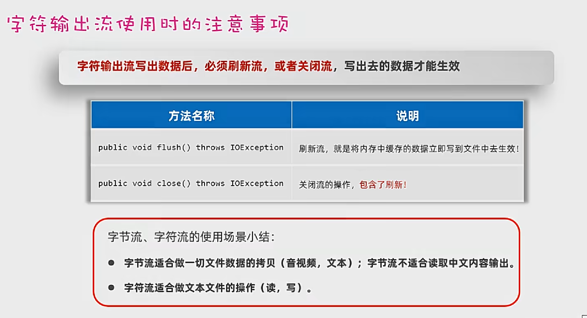

- 当写出数据时，重复调用系统资源会导致消耗过大。因此在写出流写出数据时会暂存在缓冲区中，当刷新流，或关闭流时会将缓冲区的文件存入文件。当数据过多缓冲区满时，会自动存入文件。

#### 缓冲流

##### 字节缓冲流

~~~java
// public BufferedOutputStream(OutputStream out, int size)；
// 可以通过构造函数来指定缓冲区的大小
FileOutputStream os = new FileOutputStream("Function-test/src/com/sun/FileOperator/IOFileOutputStream/IOFileoutputStreamTest01.txt");
                OutputStream bos = new BufferedOutputStream(os, 2048*4);
~~~

##### 字符缓冲流

用法及功能参考字节缓冲流

###### 字符缓冲输入流

###### 字符缓冲输出流

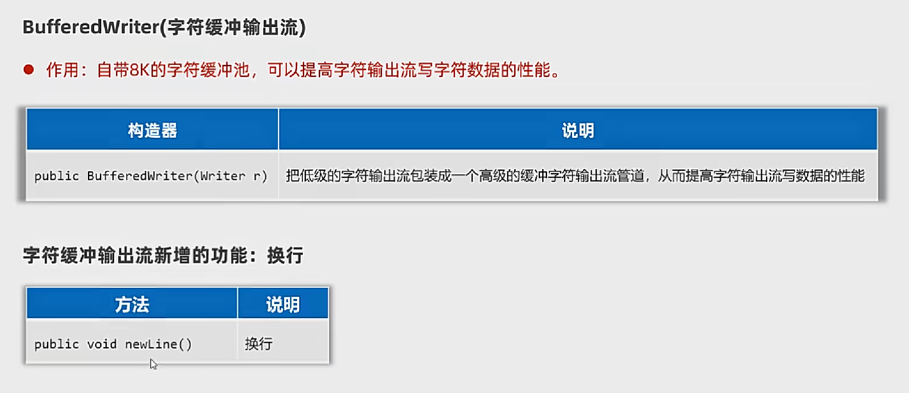

##### 原始流、缓冲流的性能分析

#### 转换流

##### 引出问题：不同编码读取时会乱码

##### InputStreamReader字符输入转换流

##### OutputStreamWriter字符输出转换流

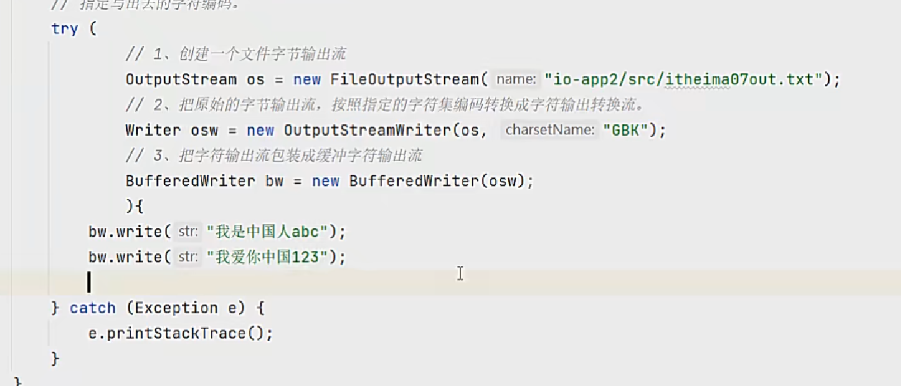

#### 打印流（不支持追加数据）

##### 打印流有什么作用

- 打印流可以实现更方便、更高效的打印数据出去，能实现打印啥出去就是啥出去。非打印流输出97时输出‘a’，打印流输出97时就是97。

##### PrintStream

##### PrintWriter

##### 打印流的应用：输出语句的重定向

- 可以把输出语句的打印位置改到某个文件中去

~~~java
package com.sun.FileOperator.Output_Redirection;

import java.io.FileNotFoundException;
import java.io.PrintStream;

public class main {
    public static void main(String[] args) {

        System.out.println("abcdefg");
        System.out.println("hijklmn");

        try (PrintStream ps = new PrintStream("D:\\Develop\\Code\\JAVA-idea2022\\progrom case learning\\progrom case learning\\Function-test\\src\\com\\sun\\FileOperator\\Output_Redirection\\out.txt")){
            // 把系统默认的打印流设置为自己的打印流
            System.setOut(ps);
            System.out.println("opq");
            System.out.println("rst");
        } catch (Exception e) {
            throw new RuntimeException(e);
        }

    }
}

~~~

#### 数据流

DataOutputStream（数据输出流）

- 允许把数据和起类型一并写出去

DataInputStream（数据输入流）

- 用于读取数据输出流写出去的数据

~~~java
// 数据输入输出流
package com.sun.FileOperator.DataStream;

import java.io.DataInputStream;
import java.io.DataOutputStream;
import java.io.FileInputStream;
import java.io.FileOutputStream;

public class main {
    public static void main(String[] args) {

        // 创建数据输出流对象
        try (DataOutputStream dos = new DataOutputStream(new FileOutputStream("D:\\Develop\\Code\\JAVA-idea2022\\progrom case learning\\progrom case learning\\Function-test\\src\\com\\sun\\FileOperator\\DataStream\\DataStreamTest.txt"));){
            dos.writeInt(1); // 使用数据输出流输出int型数据
            dos.writeDouble(1.2); // 使用数据输出流输出Double型数据
            dos.writeBoolean(true); // 使用数据输出流输出Boolean型数据
            dos.writeUTF("String"); // 使用数据输出流输出UTF-8编码型字符串数据
        } catch (Exception e) {
            throw new RuntimeException(e);
        }

        // 创建数据输入流对象 (读取数据应与文件输入数据一样)
        try (DataInputStream dis = new DataInputStream(new FileInputStream("D:\\Develop\\Code\\JAVA-idea2022\\progrom case learning\\progrom case learning\\Function-test\\src\\com\\sun\\FileOperator\\DataStream\\DataStreamTest.txt"));){
            int i = dis.readInt();
            double d = dis.readDouble();
            boolean b = dis.readBoolean();
            String s = dis.readUTF();
            System.out.println(i); // 使用数据输入流读取int型数据
            System.out.println(d); // 使用数据输入流读取double型数据
            System.out.println(b); // 使用数据输入流读取boolean型数据
            System.out.println(s); // 使用数据输入流读取UTF-8编码型字符串
        } catch (Exception e) {
            throw new RuntimeException(e);
        }

    }
}

~~~

#### 序列化流

- 对象的序列化：把Java对象写入到文件中去
- 对象的反序列化：把文件里的Java对象读出来

对象如果要序列化，必须实现序列化接口。

**对象字节输出流（序列化）**

**对象字节输入流（反序列化）**

~~~java
package com.sun.FileOperator.Serialization;

import java.io.*;

public class main {
    public static void main(String[] args) {

        // 创建一份对象输出流包装原始字节输出流
        try(ObjectOutputStream oos = new ObjectOutputStream(new FileOutputStream("D:\\Develop\\Code\\JAVA-idea2022\\progrom case learning\\progrom case learning\\Function-test" +
                "\\src\\com\\sun\\FileOperator\\Serialization\\ObjectOutputStreamtest.txt"));) {
            // 创建一个Java对象
            User u = new User("admin", "张三", 32, "666888xyz");
            // 序列化Java对象到文件中去
            oos.writeObject(u);
            System.out.println("序列化对象成功");
        }
        catch (Exception e) {
            e.printStackTrace();
        }

        // 创建一个对象输出流管道，包装低级的字节输入流与源文件接通
        try(ObjectInputStream ois = new ObjectInputStream(new FileInputStream("D:\\Develop\\Code\\JAVA-idea2022\\progrom case learning\\progrom case learning\\Function-test" +
                "\\src\\com\\sun\\FileOperator\\Serialization\\ObjectOutputStreamtest.txt"));) {
            User u = (User) ois.readObject();
            System.out.println(u);
        }
        catch (Exception e) {
            e.printStackTrace();
        }

    }
}

class User implements Serializable {

    private String losginName;
    private String username;
    private int age;
    private String passWord;

    public User() {
    }

    public User(String losginName, String username, int age, String passWord) {
        this.losginName = losginName;
        this.username = username;
        this.age = age;
        this.passWord = passWord;
    }

    public String getLosginName() {
        return losginName;
    }

    public String getUsername() {
        return username;
    }

    public int getAge() {
        return age;
    }

    public String getPassWord() {
        return passWord;
    }

    public void setLosginName(String losginName) {
        this.losginName = losginName;
    }

    public void setUsername(String username) {
        this.username = username;
    }

    public void setAge(int age) {
        this.age = age;
    }

    public void setPassWord(String passWord) {
        this.passWord = passWord;
    }

    @Override
    public String toString() {
        return "User{" +
                "losginName='" + losginName + '\'' +
                ", username='" + username + '\'' +
                ", age=" + age +
                ", passWord='" + passWord + '\'' +
                '}';
    }
}
~~~

##### transient(不进行序列化)

在成员变量前加关键字transient可以不序列化该变量

ArrayList集合已经实现了序列化接口

#### IO框架

##### 什么是框架

- 为解决某类问题，编写的一套类、接口等，可以理解为一个半成品，大多框架都是第三方研发的
- 好处：在框架的基础上开发，可以得到优秀的软件架构，并能提高开发效率
- 框架的形式：一般是把类、接口等编译成class形式，再压缩成一个.jar结尾的文件发行出去

##### 什么是IO 框架

- 封装了Java提供的对文件、数据进行操作的代码，对外提供了更简单的方式来对文件进行操作，对数据进行读写等。

##### Commons-io

 

## 特殊文件、日志框架

### 特殊文件

####  属性文件.properties

注释行开头为'#'号

属性文件的内容都是一些键值对信息，每行都是一个键值对。

属性文件的后缀一般都是.properties

~~~java
package com.sun.SpecialFile.PropertiesTest;

import java.io.FileReader;
import java.util.Properties;
import java.util.Set;

public class main {
    public static void main(String[] args) throws Exception {

        // 创建一个Peoperties对象（键值对集合，空容器）
        Properties properties = new Properties();
        System.out.println(properties);

        // 加载键值对到容器中去
        properties.load(new FileReader("Function-test\\src\\com\\sun\\SpecialFile\\PropertiesTest\\PropertiesTest.properties"));
        System.out.println(properties);

        // 根据键来取值
        System.out.println(properties.getProperty("赵敏"));

        // 遍历全部的键和值
        Set<String> keys = properties.stringPropertyNames(); // 使用该方法将键返回为一个集合
        for(String key : keys) {
            String value = properties.getProperty(key);
            System.out.println(key + "--->" + value);
        }

    }
}

~~~

#### XML文件.xml（可扩展标记语言）

- 本质是一种数据的格式，可以用来存储复杂的数据结构和数据关系

注释行开头为`<!--`，结尾为`-->`

XML文件的内容都是开始标签和结尾标签的形式

##### XML的特点

- XML中的"<标签名>"称为一个标签或一个元素，一般是成对出现的。
- XML中的标签名可以自己定义（可扩展），但必须要正确的嵌套。
- XML中只能有一个根标签。
- XML中的标签可以有属性。
- 如果一个文件中放置的是XML格式的数据，这个文件就是XML文件，后缀一般要写成.XML。

##### XML的语法规则

- XML文件的后缀名为xml，文档声明必须是第一行
- XML中可以定义注释信息：<!-- -->
- XML中书写"<"\"&"等，可能会出现冲突，导致报错，此时可以用以下特殊字符代替。

~~~xml
&lt; < 小于
&gt; > 大于
&amp; $ 和号‘
&apos; '' 单引号
&quot; "" 双引号
~~~

- XML中可以写一个叫CDATA的数据区：<![CDATA[...内容...]]>，里面的内容可以随便写。

~~~xml
<?xml version="1.0" encoding="UTF-8" ?>
<!-- 注释：以上抬头声明必须放在第一行且必须存在 -->
<!-- 抬头声明中：
		version：XML默认的版本号码、该属性是必须存在的
		encoding：本XML文件的编码 -->
<users>
    <!-- 根标签只能有一个 -->
    <user id ='1'>
        <name>张无忌</name>
        <sex>男</sex>
        <password>minmin</password>
    </user>
    <user id = '2'>
        <name>敏敏</name>
        <sex>女</sex>
        <password>wuji</password>
    </user>
</users>
~~~

##### XML的作用和应用场景

- 本质是一种数据格式，可以存储复杂的数据结构和数据关系
- 应用场景：经常用来作为系统的配置文件，或者作为一种特殊的数据结构，在网络中传输。

##### 使用程序读取XML文件中的数据（解析XML文件）

**使用Dom4j框架解析**

~~~java
// 通过导入Dmo4j框架来实现对XML文件的解析操作
package com.sun.SpecialFile.XMLFile;

import org.dom4j.Attribute;
import org.dom4j.Document;
import org.dom4j.DocumentException;
import org.dom4j.Element;
import org.dom4j.io.SAXReader;

import java.util.List;

public class main {
    public static void main(String[] args) throws DocumentException {

        // 创建一个Dmo4j框架提供的解析器对象
        SAXReader saxreader = new SAXReader();

        // 使用SAXReader对象把需要解析的XML文件读成一个Document对象
        Document document = saxreader.read("Function-test/src/com/sun/SpecialFile/XMLFile/XMLTest.xml");

        // 从文档对象中解析XML文件的全部数据
        Element root = document.getRootElement(); // 通过解析获取根元素
        System.out.println(root.getName());

        // 获取根元素下所有一级子元素并存入List集合
        List<Element> elements = root.elements();
        elements.forEach((e) -> System.out.println(e.getName()));

        // 获取根元素下指定子元素
        // 如果根元素下有多个相同子元素，则默认调第一个
        Element user = root.element("user");
        System.out.println(user.element("name").getText());

        // 获取元素的属性信息
        // 方法1
        System.out.println(user.attributeValue("id"));

        // 方法2
        Attribute id = user.attribute("id");
        System.out.println(id.getName() + '-' + id.getValue());

        // 方法3：获取全部一级子元素的属性信息
        List<Attribute> ids = user.attributes();
        for(Attribute it : ids) {
            System.out.println(it.getName() + it.getValue());
        }

        // 获取全部的文本内容
        System.out.println(user.elementText("name"));
        System.out.println(user.elementText("sex"));
        System.out.println(user.elementTextTrim("sex")); // 取出文本取出前后空格
        System.out.println(user.elementText("password"));

    }
}

~~~

##### 将内容写出为XML文件

推荐使用IO流直接拼接输出。

##### 约束XML文件的编写

- 就是限制XML文件只能按照某种格式进行书写。

###### 约束文档

- 专门用来限制XML书写格式的文档，比如：限制标签、属性应该怎么写。

###### 约束文档的分类

- DTD文档
- Schema文档

###### DTD文档的使用

1. 编写DTD约束文档，后缀必须是.dtd
2. 在需要编写的XML文件中导入该DTD约束文档
3. 然后XML文件就必须按照DTD约束文档指定的格式进行编写，否则报错。

注意：

- DTD不能约束具体的数据类型。

**XML文档部分**

~~~xml
<?xml version="1.0" encoding="UTF-8" ?>
<!DOCTYPE 书架 SYSTEM "data.dtd"> <!--将dtd文件导入-->
<书架>
    <书>
        <书名></书名>
        <作者></作者>
        <售价></售价>
    </书>
</书架>
~~~

**DTD文档部分**

~~~dtd
<!ELEMENT 书架 (书+)>
<!--书架为根目录名，小括号内为子元素，+号代表子元素个数必须为一个及以上-->
<!ELEMENT 书 (书名,作者,售价)>
<!ELEMENT 书名 (#PCDATA)>
<!ELEMENT 作者 (#PCDATA)>
<!ELEMENT 售价 (#PCDATA)>

~~~

###### schema文档的使用

1. 编写schema约束文档，后缀必须是.xsd。
2. 在需要编写的XML问价中导入该schema文档。
3. 按照约束内容编写XML文件的标签

### 日志技术

- 把程序运行的信息，记录到文件中，方便程序员定位bug、并了解程序的执行情况等。

**作用**

- 可以将系统执行的信息，方便的记录到指定的位置（控制台、数据库中、文件中）。
- 可以随时以开关的形式控制日志的启停，无需侵入到源代码中去进行修改。

### 日志技术的体系

#### 日志框架

JUL（java.util.logging）、Log4j、Logback等 。

#### 日志接口

-  Commons Logging（JCL）
- Simple Logging Facade for Java（SLF4J）

### Logback

Logback日志框架下载网址：https://logback.qos.ch/index.html

#### Logback日志框架模块

- logback-core：基础模块，是其他两个模块依赖的基础（必须）
- logback-classic：完整实现了slf4j API的模块（必须）
- logback-access：与Tomcat和Jetty等Servlet容器集成，以提供http访问日志的功能（可选）

#### 日志级别

- 日志级别指的是日志信息的类型，日志都会分级别，常见的日志级别如下（优先级以此升高）。

| 日志级别 |                             说明                             |
| :------: | :----------------------------------------------------------: |
|  trace   |                   追踪，指明程序运行轨迹。                   |
|  debug   |  调试，实际应用中一般将其作为最低级别，而trace则很少使用。   |
|   info   | 输出重要的运行信息，数据连接、网络连接、IO操作等等，使用较多。 |
|   warn   |             警告信息，可能会发生问题，使用较多。             |
|  error   |                     错误信息，使用较多。                     |

## 多线程

- 多线程是从软硬件上实现的多条执行流程的技术（多条线程由CPU负责调度执行）。

- Java是通过java.lang.Thread类的对象来代表线程的。

### 线程的创建方式

#### **第一种：继承Thread类**

##### **创建方法**

1. 定义一个子类MyThread继承线程类java.lang.Thread，重写run()方法。
2. 创建MyThread对象
3. 调用线程对象的start()方法启动线程（启动后还是执行run方法的）

~~~java
package com.sun.MyThreadOne;

public class ThreadTest {
    public static void main(String[] args) { // main函数是由一条默认的主线程负责执行

        // 创建MyTread类的对象来代表一个线程
        Thread t = new MyTread();

        // 启动线程（自动执行run方法）
        t.start();

        for(int i = 0; i < 5; i++) {
            System.out.println("main线程正在执行"+i);
        }

    }
}

// 让子类继承Thread线程类
class MyTread extends Thread {

    // 必须重写Thread类的run方法
    @Override
    public void run() {

        // 描述线程的任务
        for(int i = 0; i < 5; i++) {
            System.out.println("MyThread线程正在执行"+i);
        }

    }
}
~~~

#####  **优缺点**

优

- 编码简单

缺

- 线程类已经继承Thread，无法继承其他类，不利于功能的扩展。

#### 第二种：实现Runnable接口

##### 创建方法

1. 定义一个线程任务类MyRunnable实现Runnable接口，重写run()方法。
2. 创建MyRunnable任务对象。
3. 把MyRunnable任务对象交给Thread处理（通过Thread提供的有参构造）。
4. 调用线程对象的start()方法启动线程。

~~~java
package com.sun.MyThreadTwo;

public class RunnableTest {
    public static void main(String[] args) {

        // 创建任务对象
        Runnable target = new MyRunnable();
        // 把任务对象交给一个线程对象处理
        // Thread(Runnable target, @SuppressWarnings("removal") AccessControlContext acc) 有参构造
        new Thread(target).start();
        for(int i = 0; i < 5; i++) {
            System.out.println("main线程输出--" + i);
        }

    }
}

// 定义一个任务类实现一个Runnable接口
class MyRunnable implements Runnable {

    @Override
    public void run() {
        // 线程要执行的任务
        for(int i = 0; i < 5; i++) {
            System.out.println("MyRunnable线程输出--" + i);
        }

    }
}
~~~

##### 优缺点

- 优：任务类只是实现接口，可以继续继承其他类、实现其他接口，扩展性强。
- 缺：需要多一个Runnable对象。

##### 匿名内部类的创建方法

1. 可以创建Runnable对象的匿名内部类对象。
2. 再交给Thread线程对象。
3. 在调用线程对象的start()方法启动线程。

~~~java
// 线程的第二种创建方式的匿名内部类写法。
package com.sun.MyThreadTwo;

public class RunnableTest2 {
    public static void main(String[] args) {

        Runnable target = new Runnable() {
            @Override
            public void run() {
                for(int i = 0; i < 5; i++) {
                    System.out.println("Runnable线程输出" + i);
                }
            }
        };
        new Thread(target).start();

        // 简化形式1
        new Thread(new Runnable() {
            @Override
            public void run() {
                for(int i = 0; i < 5; i++) {
                    System.out.println("Runnable简化1线程输出" + i);
                }
            }
        }).start();

        // 简化形式2：通过Lambda形式简化
        new Thread(() -> {
            for(int i = 0; i < 5; i++) {
                System.out.println("Runnable简化2线程输出" + i);
            }
        }).start();

        for(int i = 0; i < 5; i++) {
            System.out.println("main线程输出" + i);
        }

    }
}

~~~

#### 第三种：实现Callable接口

##### 前两种方法存在的问题

- 假如线程执行完毕后有一些数据需要返回，他们重写的run方法均不能直接返回结果。
- JDK5.0提供了Callable接口和FutureTask类来实现（这种方法可以直接返回线程执行的结果）。

##### 创建方法

1. 创建任务对象
   - 定义一个类实现Callable接口，重写call方法，封装要做的事情和要返回的数据。
   - 把Callable类型的对象封装成FutureTask（线程任务对象）。
2. 把线程任务对象交给Thread对象。
3. 调用Thread对象的Start方法启动线程。
4. 线程执行完毕后，通过FuntureTask对象的get方法去获取线程任务执行的结果。

~~~java
package com.sun.MyThreadThree;

import java.util.concurrent.Callable;
import java.util.concurrent.ExecutionException;
import java.util.concurrent.FutureTask;

public class CallableTest {
    public static void main(String[] args) throws ExecutionException, InterruptedException {

        // 创建一个Callable对象（非任务对象）。
        Callable<String> call1 = new MyCallable(100);
        Callable<String> call2 = new MyCallable(200);

        // 把Callable的对象封装成FutureTask对象（任务对象）。
        // 未来任务对象的作用
        // 1.是一个任务对象实现了Runnable接口。
        // 2.可以在线程执行完毕后，用未来任务对象调用get方法获取线程执行完毕后的结果。
        FutureTask<String> f1 = new FutureTask<>(call1);
        FutureTask<String> f2 = new FutureTask<>(call2);

        // 把任务交给一个Thread对象。
        new Thread(f1).start();
        new Thread(f2).start();

        // 获取线程执行完毕后返回的结果。
        // 注意：如果执行到这里上面的线程还没有执行完毕。这里的代码会暂停，等待上面线程执行完毕后才会获取结果。
        String rs1 = f1.get();
        System.out.println(rs1);
        String rs2 = f2.get();
        System.out.println(rs2);

    }
}

// 使MyCallable类实现Callable接口
class MyCallable implements Callable<String> {

    private int n;

    public MyCallable(int n) {
        this.n = n;
    }

    // 重写call方法
    // 描述线程需要执行的任务
    @Override
    public String call() throws Exception {

        int sum = 0;
        for(int i = 1; i <= n; i++) {
            sum += i;
        }
        return "线程求出了1-" + n + "的和是" + sum;

    }
};
~~~

##### 优缺点

- 优点：线程任务类只是实现接口，可以继续继承类和实现接口，扩展性强；可以在线程执行完毕后去获取线程执行的结果。
- 缺点：编码较复杂。

### 线程常用方法

### 多线程的注意事项

1. 启动线程必须是调用start方法，不是调用run方法。
   - 直接调用run方法会当成普通方法执行，此时相当于还是单线程执行。
   - 只有调用start方法才是启动一个新的线程执行。
2. 不要把主线程任务放在启动子线程之前。
   - 这样主线程是一直先跑完的，相当于是一个单线程的效果了。

### 线程安全

#### 什么是线程安全问题

- 多个线程，同时操作同一个共享资源的时候，可能会出现业务安全问题。

- 出现的原因
  - 多个存在多个线程在同时执行
  - 同时访问一个共享资源
  - 存在修改该共享资源

### 线程同步

- 解决线程安全问题的方案。

- 让多个线程实现先后访问共享资源，这样就解决了安全问题。

#### 线程同步的常见方案

- 加锁：每次只允许一个线程加锁，加锁后才能进行访问，访问完毕后自动解锁，然后其他线程才能再加锁进来。
- 加锁实现方案
  - 方案一：同步代码块
  - 方案二：同步方法
  - 方案三：Lock锁

#### 加锁方案1：同步代码块

- 作用：把访问共享资源的核心代码给上锁，以此保证线程安全。

- `synchronized(同步锁){访问共享资源的核心代码}`
- 原理：每次只允许一个线程加锁后进入，执行完毕后自行解锁，其他线程才可以进来执行。
- 同步锁的注意事项：对于当前执行的线程来说，同步锁必须是同一把（同一个对象），否则会出bug。

##### 锁对象的使用规范

- 建议使用共享资源作为锁对象
  - 对于实例方法建议使用this作为锁对象。
  - 对于静态方法建议使用字节码（类名.class）对象作为锁对象。

##### 加锁方案2：同步方法

- 作用：把访问共享资源的核心方法给上锁，以此保证线程安全。
- `修饰符 synchronized 返回值类型 方法名称（形参列表）{操作共享资源的代码}`
- 原理：每次只允许一个线程加锁后进入，执行完毕后自行解锁，其他线程才可以进来执行。
- 同步方法底层原理
  - 如果方法是实例方法：同步方法默认用this作为锁对象
  - 如果方法是静态方法：同步方法默认用类名.class作为锁对象

##### 加锁方案3：Lock锁

- Lock锁是JDK5开始提供的一个新的锁定操作，通过它可以创建出锁对象进行加锁和解锁，更灵活、更方便、更强大。
- Lock是接口，不能直接实例化，可以采用它的实现类ReentrantLock来构建Lock锁对象。

### 线程通信

- 当多个线程共同操作共享的资源时，线程间通过某种方式互相告知自己的状态，以相互协调，并避免无效的资源抢夺。
