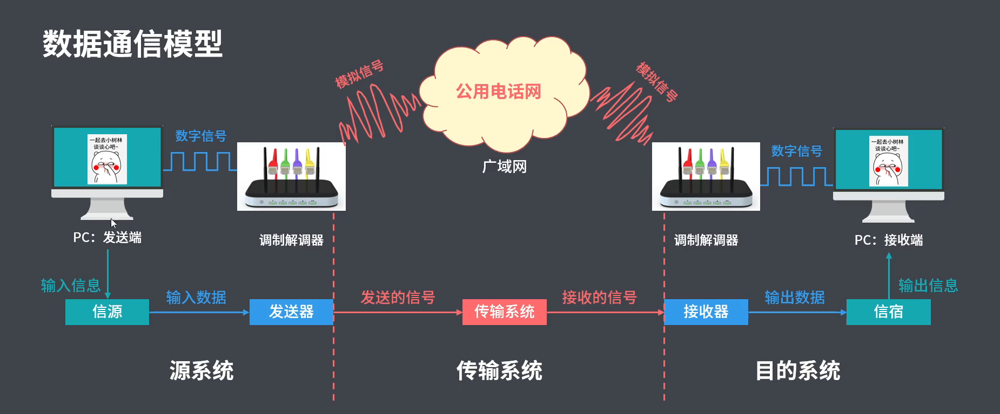
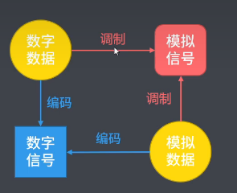
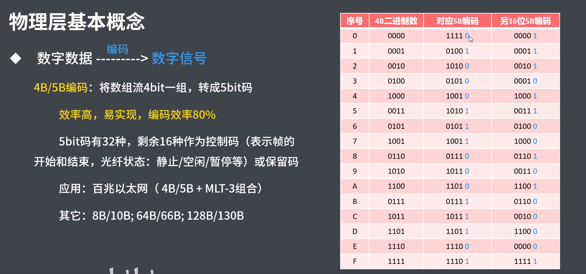
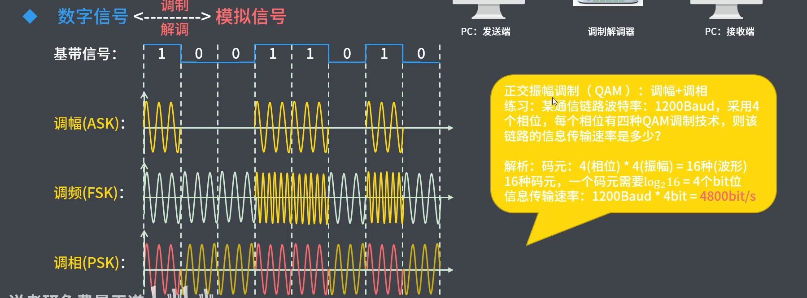
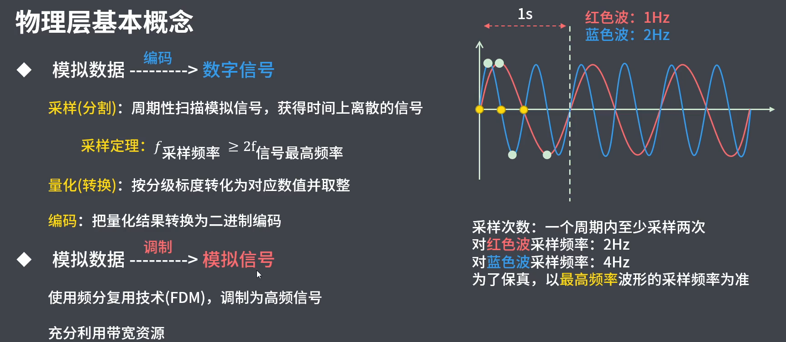

# 物理层

- 透明地传输比特流，为数据端设备提供传输数据地通路集线器、中继器。
- 关注物理层应该具备的规则、接口、实体的特点而**非实体本身**

## 物理层是怎么通信的

### 物理层基本概念

#### 物理层接口特性（标准）

- 机械特性：形状和尺寸、数目和排列、固定和锁定装置等。
- 电气特性：电压范围、阻抗匹配、传输速率和距离限制等。
- 功能特性：某电平代表的含义。
- 过程特性：也叫规程特性，不同功能的出现顺序。

#### 数据通信模型

#### 信号、信道、码元（传输速率）

- 物理层的基本概念

  - 数据：运送消息的实体。

  - 信号：数据的电气或电磁表现。

    - 模拟信号（宽带传输）：连续变化的值。
    - 数字信号（基带传输）：仅允许有限的离散值。

  - 信道：信号传输的媒介。

    - 信噪比：信号平均功率（S）和噪声平均功率（N）之比。
      $$
      信噪比（dB）= \log_{10}{(S/N)}
      $$

  - 信道的三种传输方式

    - 单向（单工）通信：一条信道
    - 双向交替（半双工）通信：两条信道，不能同时发/收。
    - 双向同时（双工）通信：两条信道，可以同时收/发。
    
  - 数据传输方式
  
    - 串行传输：速度慢、费用低，适合远距离（比如城市之间）
    - 并行传输：速度块、费用高，适合近距离（比如计算机内部）
  
  - 码元：一个固定时长（码元长度）的信号波形，码元是承载信息量的基本单位。
  
    - M进制码元：码元的状态有M个
    - 码元传输速率：1Baud = 1 码元/s（单位时间传输码元个数，单位是波特（Baud））
    - 信息传输速率：单位时间传输二进制码元的个数，单位是bit/s

#### 编码与调制 

- 编码 -> 数字信号
- 调制 -> 模拟信号
- 数据：数字数据/模拟数据

- 编码（数字数据编码位数字信号）
  - 非归零制（NRZ）编码：正电平为1，负电平为0；（易实现；无检错，难以时钟同步）。
  - 归零制（RZ）编码：正脉冲为1，负脉冲为0，码元内归零。（易实现，时钟同步；占带宽）。
  - 反向非归零（NRZI）编码：码间翻转为0，不变为1。（时钟同步，带宽少；USB2.0使用该编码方法；全1需要新的信道确定时钟周期）
  - 曼切斯特编码：位周期中心的向上跳变代表0，向下跳变代表1。（码内跳变，既可时钟同步，又作数据信号；两倍带宽，速率减半（编码效率50%））
  - 差分曼彻斯特编码：在每一位的中心处始终有跳变。位开始边界有跳变代表0，无跳变代表1。（抗干扰性强；编码复杂）
  - 4B/5B编码：

- 调制（数字信号调制成模拟信号）

  - 调制方式：调幅（ASK）：抗干扰能力差、调频（FSK）：抗干扰能力强、调相（PSK）。

    

- 模拟数据的编码与调制

### 数据通信基础

## 物理层都有哪些硬件设备

